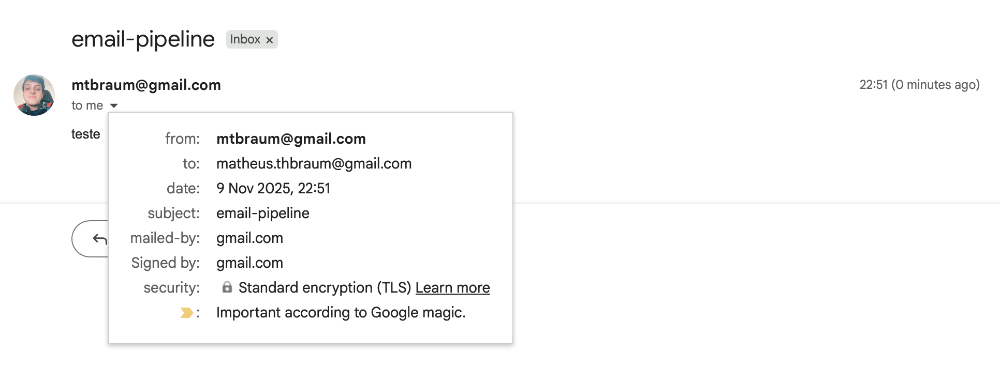
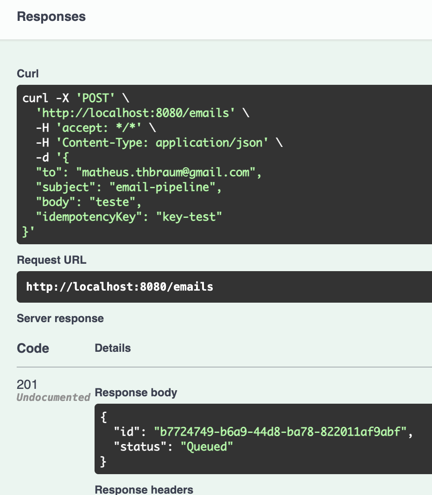
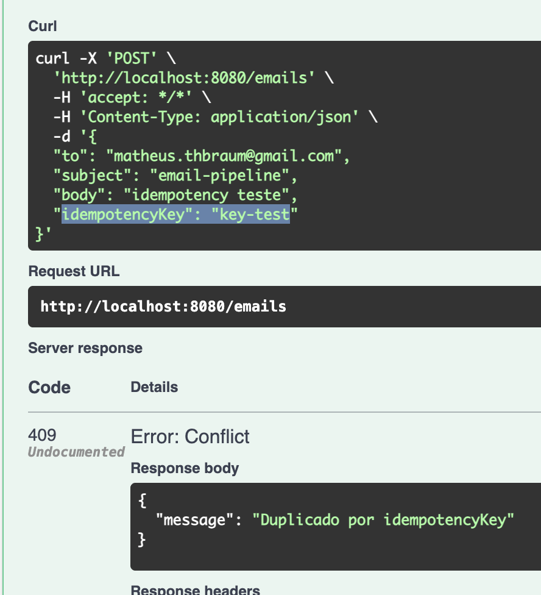
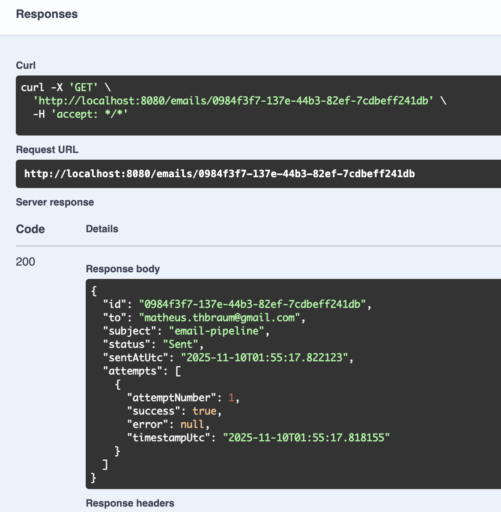
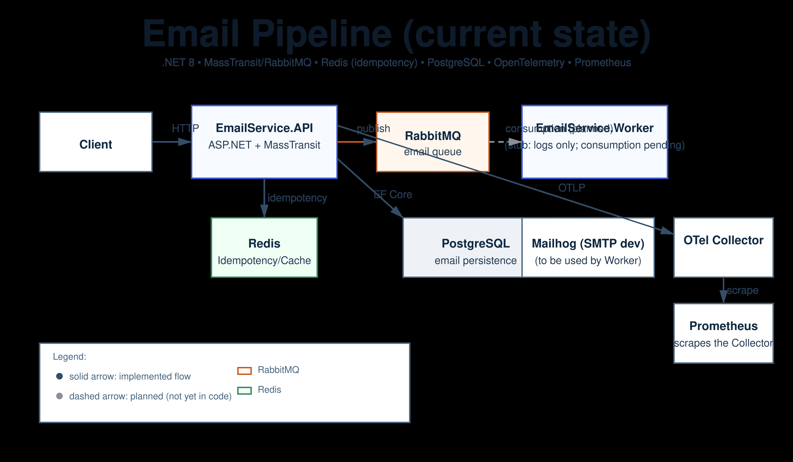

Email Pipeline
==============

**Tech stack:** .NET 8 · RabbitMQ · Redis · PostgreSQL · OpenTelemetry · Prometheus

This project demonstrates an asynchronous and resilient email delivery pipeline with observability, built in .NET 8.






Architecture diagram
--------------------

The diagrams below reflect the current state of this repository:

<p align="center">
  
  <br/>
  <sub>Solid arrows = implemented · Dashed arrows = planned/not yet in code</sub>
</p>


See [QUICK_SUMMARY.md](./QUICK_SUMMARY.md) for QUICK SUMMARY overview.

Overview
--------

This repository contains an example Email Pipeline implemented in .NET (C#). The project demonstrates a production-oriented approach for reliably delivering emails at scale by separating responsibilities across a lightweight API and an asynchronous worker. The design focuses on resiliency (retries, dead-lettering), idempotency, and observability (traces and metrics).

Main responsibilities:
- API: receives email requests from clients, validates payloads, enqueues jobs into a message broker (RabbitMQ), and returns an immediate acknowledgement to the caller.
- Worker: consumes email jobs from RabbitMQ, performs delivery attempts to an SMTP provider, records attempt history and final status to PostgreSQL, and emits telemetry and metrics.
- Infrastructure: shared implementations for storage, queueing, deduplication (Redis), and email sending providers. Contracts contains DTOs and interfaces used by both API and Worker.

Projects
--------

- EmailService.Api/ - ASP.NET Core Web API that exposes email-related endpoints and health checks.
- EmailService.Worker/ - Background worker (generic host) that processes queued emails or background tasks.
- EmailService.Infrastructure/ - Implementation details for storage, email sending, and other infrastructure services.
- EmailService.Contracts/ - Shared contracts, DTOs and interfaces used across the solution.

Architecture (ASCII)
--------------------

A tiny visual of the data flow:

```
Client -> API -> RabbitMQ -> Worker -> SMTP
                   |             |
                   |             +-> PostgreSQL (attempts/history)
                   +-> Redis (dedup / rate-limiting / locks)
```


Prerequisites
-------------

- .NET SDK 8.0 (the projects target `net8.0`). Install from https://dotnet.microsoft.com/
- Optional: Docker & docker-compose (there is a `docker-compose.yml` in the repo)
- Optional: An SMTP/Email provider or service for sending emails (configured via appsettings or environment variables)

Quick start - Local (dotnet)
----------------------------

1. Open a terminal and restore & build the solution:

```zsh
cd /path/to/email-pipeline
dotnet restore
dotnet build
```

2. Run the API locally (from the API project folder):

```zsh
cd src/EmailService.Api
dotnet run --project EmailService.Api.csproj
```

By default ASP.NET will print the listening URLs (for example: https://localhost:5001 and http://localhost:5000). Use the URL shown in the output to call the API.

3. Run the Worker locally (from the Worker project folder):

```zsh
cd src/EmailService.Worker
dotnet run --project EmailService.Worker.csproj
```

Configuration and Secrets
-------------------------

- Development configuration files such as `appsettings.Development.json` are present in the project folders. Local secrets (API keys, SMTP credentials) should be stored securely and not committed to the repo.
- Recommended options for local development:
  - Use dotnet user-secrets for per-user secrets in development: `dotnet user-secrets set "Smtp:Password" "value"` (run from the project directory where user-secrets is configured).
  - Or use environment variables; the app reads configuration via the default ASP.NET configuration providers.
- Files commonly ignored by source control (like `appsettings.Development.json`, local `.env` files and `secrets.json`) are in the repository's `.gitignore`.

Docker / Docker Compose
-----------------------

The repository contains a `docker-compose.yml` suitable for running the solution with containers. To run the solution with Docker:

```zsh
# Build and start services defined in docker-compose.yml
docker compose up --build

# Or to run in detached mode
docker compose up -d --build
```

If you have `docker` as the terminal in your system, use the same commands there.

Environment (.env)
-------------------

This repo uses a `.env` file to configure the API and Worker when running with Docker. A safe template is available as `.env.sample`.

- Copy it and customize:

```zsh
cp .env.sample .env
# edit values as needed (Gmail SMTP, passwords, etc.)
```

- Never commit real credentials. The `.gitignore` already excludes `.env`.
- Key groups in `.env`:
  - PostgreSQL: `POSTGRES_USER`, `POSTGRES_PASSWORD`, `POSTGRES_DB`
  - RabbitMQ: `Rabbit__Host`, `Rabbit__User`, `Rabbit__Pass`
  - Redis: `Redis__Connection`
  - OpenTelemetry: `Otel__Endpoint`
  - SMTP: `Smtp__Host`, `Smtp__Port`, `Smtp__EnableSsl`, `Smtp__User`, `Smtp__Pass`, `Smtp__From`

SMTP configuration
------------------

You can use Mailhog for development or Gmail (with App Password) for real delivery:

- Mailhog (default dev):
  - Mailhog runs via docker-compose on ports 1025 (SMTP) and 8025 (Web UI).
  - Set in `.env` (or leave defaults):
    - `Smtp__Host=mailhog`
    - `Smtp__Port=1025`
    - `Smtp__EnableSsl=false`
    - leave `Smtp__User`, `Smtp__Pass`, `Smtp__From` empty
  - Open http://localhost:8025 to view captured emails.

- Gmail (production-like):
  - Requires a Google App Password (two-factor auth enabled on the account).
  - Set in `.env`:
    - `Smtp__Host=smtp.gmail.com`
    - `Smtp__Port=587`
    - `Smtp__EnableSsl=true`
    - `Smtp__User=seu_email@gmail.com`
    - `Smtp__Pass=<app_password_gerado_no_google>`
    - `Smtp__From=seu_email@gmail.com`
  - Notes:
    - App Passwords are different from your Google password. See Google Account → Security → App passwords.
    - Don’t commit `.env`. Treat it as a secret.

Swagger UI
----------

The API exposes Swagger/OpenAPI for interactive testing and documentation:

- Navigate to http://localhost:8080/swagger when running via Docker.
- The OpenAPI JSON is at http://localhost:8080/swagger/v1/swagger.json.

## Endpoints

### `POST /emails`
Receives an email payload and enqueues it for processing.

**Request Body:**
```json
{
  "to": "user@example.com",
  "subject": "Hello!",
  "body": "This is a test email.",
  "idempotencyKey": "optional-key-123"
}
```

Description:
- Validates the payload (recipient format, subject/body length, optional attachments metadata).
- If an `idempotencyKey` is supplied the API checks Redis for an existing request with that key. If present it returns the existing `emailId` and status instead of enqueueing a duplicate job.
- On success the endpoint returns a 202 Accepted with a lightweight resource containing the generated `emailId` and initial status (Queued).

Responses:
- 202 Accepted
  - Body example:
```json
{
  "emailId": "c9f1b5d4-3a2e-4f7b-9a0d-2d2a8f9a1234",
  "status": "Queued",
  "message": "Email accepted and enqueued"
}
```
- 400 Bad Request — invalid payload
- 409 Conflict — idempotency key exists but points to a conflicting request (rare, business-rule dependent)
- 500 Internal Server Error — transient server issue (retry-safe on client side)

### `GET /emails/{id}`
Returns the email’s current status and attempt history.

Description:
- Returns a single resource describing the current delivery status for the `emailId`, a chronological list of delivery attempts (timestamp, outcome, provider response) and meta like `createdAt`, `lastAttemptAt`, `retryCount` and any error messages.

### `GET /health`
Exposes service health checks (DB, Redis, RabbitMQ).

Description:
- Returns a structured health response (JSON) indicating the readiness and connectivity to required dependencies: PostgreSQL, RabbitMQ, Redis, and optionally SMTP provider reachable check.

Responses:
- 200 OK — all checks passed
  - Body example:
```json
{
  "status": "Healthy",
  "checks": {
    "database": "Healthy",
    "rabbitmq": "Healthy",
    "redis": "Healthy"
  }
}
```
- 503 Service Unavailable — one or more critical checks failed (body contains failing components)

### `GET /metrics`
Prometheus metrics endpoint (success rate, p95 latency, retries, etc.).

Description:
- Exposes Prometheus-formatted metrics (text/plain) collected by the application via OpenTelemetry metrics exporter or the Prometheus .NET client. Metric names should include counters for `emails_enqueued_total`, `emails_sent_total`, `emails_failed_total`, histograms for delivery latency and `emails_retries_total`.

Health checks & API usage
-------------------------

- The API project usually exposes a health endpoint (check `Program.cs` and `appsettings.*`) — common routes: `/health` or `/healthz`.
- Check `src/EmailService.Api/EmailService.Api.http` for example HTTP requests (if present). Use these as examples for endpoints and payloads.

CI / Build
----------

A simple CI build should run:

```zsh
dotnet restore
dotnet build --configuration Release
# Optionally run tests (if added later)
# dotnet test
```

Troubleshooting
---------------

- If you see port binding errors, ensure no other process is using the same ports or change the launch profile or `ASPNETCORE_URLS` environment variable.
- If SMTP/third-party errors occur, verify credentials and network connectivity.
- If you need to inspect logs for the worker or API, check the console output when running with `dotnet run`, or check container logs when using Docker:

```zsh
docker compose logs -f
```

Developer notes / next steps
----------------------------

- EF Core Migrations: currently the API bootstraps tables with raw SQL on startup. A future improvement is to add EF Core migrations and switch to `Database.Migrate()` for schema changes.
- Pre-commit hooks: this repo includes `.pre-commit-config.yaml` with hooks to run `dotnet format` and `dotnet test` against `src/EmailPipeline.sln`.
  - Install once: `pipx install pre-commit` or `pip install pre-commit`
  - Enable in the repo: `pre-commit install`
  - Run on demand: `pre-commit run --all-files`
